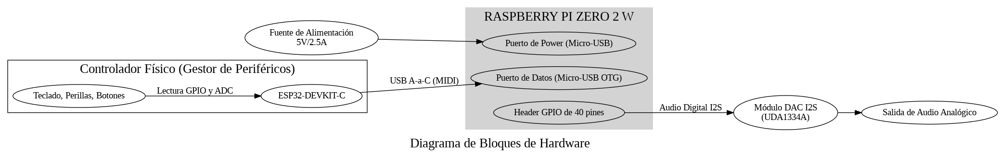
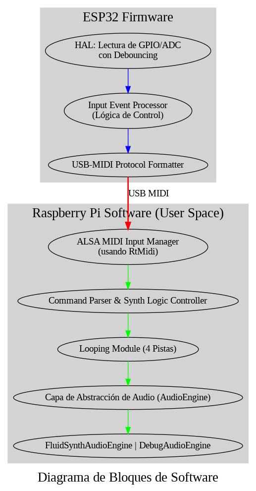

# Sintetizador Digital Embebido con Controles Físicos
**Embedded Linux Capstone Project**
**Autor: Juan Esteban Villada Sierra**
**Curso: Embedded Linux System Programming 2025-2S**

## 1. Problem Statement, System Overview, and Requirements Specification

### 1.1 Problem Statement

#### Motivación
En la producción musical moderna, existe una dicotomía persistente entre la flexibilidad ilimitada de los sintetizadores de software (DAWs, VSTs) y la inmediatez y expresividad de los sintetizadores de hardware. Mientras que el software ofrece un poder inmenso a un bajo costo, a menudo carece de la conexión táctil que fomenta la creatividad y la exploración sónica. Por otro lado, los sintetizadores de hardware con controles dedicados ofrecen esta experiencia práctica, pero a un costo prohibitivo para muchos. Investigaciones de mercado y tendencias en la industria (ej. el auge de controladores MIDI avanzados y la enorme popularidad de sintetizadores de hardware accesibles como la serie Volca de Korg o el Arturia MicroFreak) demuestran una clara demanda de soluciones que cierren esta brecha.

#### Problema del Usuario
Un músico electrónico emergente o un estudiante de tecnología creativa necesita una herramienta que sea a la vez asequible, educativa y musicalmente inspiradora. Requieren un instrumento que les permita esculpir el sonido en tiempo real con controles físicos (perillas, teclas) sin la curva de aprendizaje de complejos menús de software ni la inversión económica de un hardware comercial.

#### Propuesta de Solución
Este proyecto propone el diseño y la construcción de un sintetizador digital embebido, de bajo costo y de código abierto. El sistema ofrecerá una interfaz de usuario completamente física y táctil para el control de parámetros de síntesis (envolvente ADSR, selección de octava) y funcionalidades avanzadas de looping, proporcionando una experiencia de usuario similar a la de un equipo de producción profesional, pero impulsado por un motor de síntesis digital flexible y potente.

#### Objetivos Medibles del Proyecto
1.  **Bajo Costo:** El costo total de los componentes (Bill of Materials) no superará los $100 USD.
2.  **Baja Latencia:** La latencia end-to-end (pulsación de tecla a sonido) será inferior a 20ms.
3.  **Interfaz Intuitiva:** El control de parámetros de sonido clave será accesible a través de controles físicos dedicados, sin necesidad de menús.
4.  **Funcionalidad Avanzada:** Incluirá una función de grabación y reproducción en bucle (looping) de 4 pistas.
5.  **Plataforma Abierta:** Todo el software y los diseños serán de código abierto para fomentar la extensibilidad.

---

### 1.2 System Overview

#### Descripción End-to-End
El sistema funciona como un instrumento musical digital autónomo. El flujo de control comienza con la interacción del usuario en la interfaz física. Un microcontrolador **ESP32-DEVKIT-C** actúa como un gestor de periféricos, escaneando continuamente las teclas, botones y potenciómetros. Al detectar una acción, el ESP32 la traduce a un mensaje **MIDI estándar** y lo envía a través de un cable USB a la **Raspberry Pi Zero 2 W**.

La Raspberry Pi, ejecutando una aplicación C++ personalizada, recibe estos eventos MIDI. Basándose en los comandos, la aplicación invoca funciones de la biblioteca **FluidSynth** para generar el audio. El audio digital resultante es enviado a un **DAC I2S externo** a través del header GPIO, donde se convierte en una señal analógica lista para ser escuchada.

#### Diagrama de Bloques de Hardware

#### Diagrama de Bloques de Software

#### Estrategia de Desarrollo y Verificación
Para mitigar riesgos, el proyecto adopta una **estrategia de desarrollo desacoplado**:

1.  **Desarrollo en el Anfitrión (Host - PC/WSL):** El núcleo de la lógica de la aplicación C++ (gestión de estado, looping) se desarrolla y prueba en un entorno de PC. Se utiliza una implementación de la capa de abstracción de audio (`FluidSynthPC`) que genera sonido real en el PC, permitiendo verificar la lógica de forma auditiva y funcional sin el hardware final.
2.  **Desarrollo en el Objetivo (Target - Raspberry Pi & ESP32):** El firmware del ESP32 y la configuración de la Raspberry Pi se desarrollan y prueban de forma aislada. El controlador ESP32 se verifica como un dispositivo MIDI USB estándar. La cadena de audio de la Raspberry Pi (OS + DAC + FluidSynth) se valida de forma independiente.

Este enfoque permite un desarrollo masivo en paralelo y asegura que la fase de integración consista en unir componentes ya probados.

#### Justificación de la Plataforma y Trade-offs
*   **Raspberry Pi Zero 2 W:** Elegida por su capacidad para ejecutar un SO Linux completo (necesario para FluidSynth) en un factor de forma pequeño y de bajo costo. Su CPU Quad-core es suficiente para la síntesis de audio, pero sus 512MB de RAM requieren un SO ligero (Raspberry Pi OS Lite) y SoundFonts optimizados. La ausencia de un jack de audio nativo es un trade-off aceptado, mitigado con un DAC I2S externo para garantizar alta calidad de sonido.
*   **ESP32-DEVKIT-C:** Seleccionado para descargar las tareas de escaneo de hardware en tiempo real de la Raspberry Pi. Este enfoque de "dividir y vencer" aumenta la fiabilidad y el rendimiento del sistema. El trade-off es la necesidad de gestionar la comunicación entre dos dispositivos, mitigado mediante el uso del protocolo estándar y robusto MIDI sobre USB.
*   **FluidSynth:** Se eligió esta biblioteca por ser de código abierto, madura, y por su método de síntesis basado en SoundFonts. Esto simplifica enormemente la generación de sonidos de alta calidad, permitiendo que el proyecto se centre en la integración de hardware y la experiencia del usuario.

---

### 1.3 System Requirements Specification

#### Requerimientos de Desarrollo y Verificación
| ID | Descripción del Requerimiento | Criterios de Aceptación | Justificación / Trazabilidad |
| :--- | :--- | :--- | :--- |
| **REQ-DV-001** | El firmware del ESP32 debe ser verificable como un controlador MIDI USB autónomo. | Al conectar el ESP32 a un PC anfitrión, un software monitor de MIDI debe recibir los mensajes `Note On/Off` y `Control Change` correspondientes a cada control físico. | Permite la validación completa del hardware de entrada antes de la integración (Rubric 1.2). |
| **REQ-DV-002** | La lógica de la aplicación debe ser testable en un entorno de PC (Host). | Al ejecutar la aplicación en el Host, la interacción con un controlador MIDI virtual o físico debe producir una salida de audio correcta y un comportamiento lógico (looping, cambio de estado) idéntico al esperado en el Target. | Habilita el desarrollo y la depuración del 90% del software sin depender del hardware final (Rubric 1.2). |
| **REQ-DV-003** | La cadena de salida de audio en la Raspberry Pi debe ser verificable de forma independiente. | Al ejecutar un programa de prueba mínimo en la Raspberry Pi, se debe generar una nota audible y limpia a través del DAC I2S. | Mitiga el riesgo principal de hardware (audio en la Pi Zero 2 W) antes de integrar la lógica completa (Fase 0 Crítica). |

#### Requerimientos Funcionales
| ID | Descripción del Requerimiento | Criterios de Aceptación | Justificación / Trazabilidad |
| :--- | :--- | :--- | :--- |
| **REQ-F-001** | El sistema deberá generar notas musicales correspondientes a cada tecla del teclado físico. | Presionar una tecla debe producir la nota MIDI correcta a través del motor de síntesis. | Objetivo principal del instrumento (Objetivo 2). |
| **REQ-F-002** | El sistema permitirá la modificación en tiempo real de los 4 parámetros de la envolvente (ADSR). | Girar las perillas de ADSR debe modificar los parámetros correspondientes en FluidSynth, alterando audiblemente la forma de las notas tocadas. | Control táctil y expresivo (Objetivo 3). |
| **REQ-F-003** | El sistema permitirá al usuario desplazar el rango del teclado en +/- 2 octavas. | Presionar "Octave Up/Down" debe transponer las notas enviadas por el teclado en +/- 12 semitonos. | Expande el rango musical del instrumento. |
| **REQ-F-004** | El sistema grabará secuencias de eventos MIDI en 4 pistas de loop independientes. | Al activar la grabación en una pista, los eventos MIDI del performance en vivo deben ser capturados en un búfer con su temporización relativa. | Permite la creación de música basada en patrones (Objetivo 4). |
| **REQ-F-005** | El sistema reproducirá las secuencias grabadas en un bucle continuo. | Al activar la reproducción, los eventos MIDI grabados deben ser enviados al sintetizador repetidamente en perfecta sincronía. | Funcionalidad clave para la composición (Objetivo 4). |
| **REQ-F-006** | El sistema permitirá la asignación de instrumentos diferentes a cada pista de loop y al canal de performance en vivo. | Usando la función `SHIFT`, el usuario podrá navegar por el SoundFont y asignar un programa MIDI diferente a cada canal (1-4 para loops, 10 para performance). | Aumenta la flexibilidad sónica. |

#### Requerimientos No Funcionales
| ID | Descripción del Requerimiento | Criterios de Aceptación | Justificación / Trazabilidad |
| :--- | :--- | :--- | :--- |
| **REQ-NF-001** | La latencia de audio end-to-end debe ser inferior a 20ms. | Medido con un osciloscopio, el tiempo entre la señal de interrupción del GPIO en el ESP32 y el inicio de la forma de onda de audio en la salida del DAC debe ser < 20ms. | Crítico para una experiencia musical responsiva (Objetivo 2). |
| **REQ-NF-002** | El uso de la CPU no debe exceder el 75% de un solo núcleo de la Raspberry Pi Zero 2 W. | Mientras se reproducen 4 notas simultáneamente, el comando `top` debe mostrar que el proceso del sintetizador consume <= 75% de un núcleo. | Asegura la estabilidad del sistema. |
| **REQ-NF-003** | El sistema estará operativo en menos de 30 segundos desde el encendido. | Medir con un cronómetro el tiempo desde que se aplica energía hasta que la primera nota puede ser tocada. | Experiencia de usuario de un dispositivo hardware dedicado. |
| **REQ-NF-004** | La comunicación MIDI USB debe tener una tasa de error inferior al 0.1%. | Enviar 10,000 mensajes MIDI desde el ESP32. Un monitor en la R-Pi debe recibir y validar correctamente al menos 9,990. | Asegura la fiabilidad del control. |
| **REQ-NF-005** | El sistema operará en modo "headless" y lanzará la aplicación automáticamente al arrancar. | Al aplicar energía, la aplicación se inicia como un servicio `systemd` sin requerir intervención del usuario. | Asegura que el producto funcione como un instrumento autónomo. |